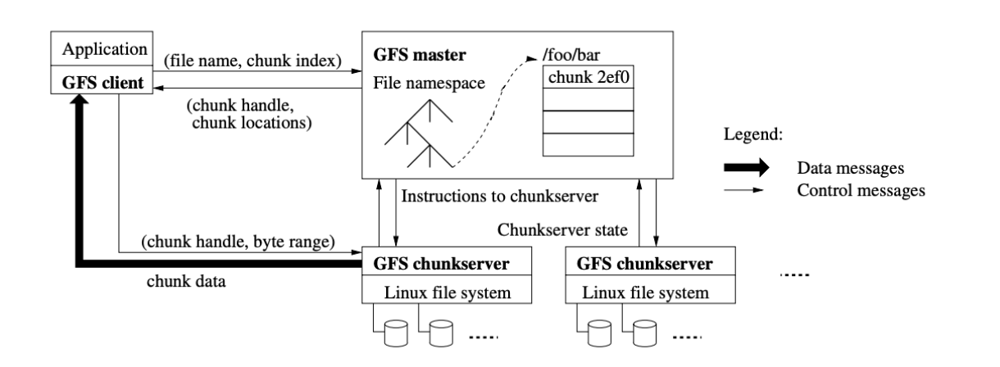

# Design Report

**Team: three-sleepy-pigs**

## Naive gDocs

### 1. Introduction

+ 文档格式：sheets

+ 基本功能
  
  + 用户登录注册：
    + 用户名作为用户身份的唯一标识
    + 用户使用用户名和密码完成注册和登录
  + 浏览文件列表
    + 所有用户可以查看和编辑所有文件
    + 以列表形式呈现了文件的文件名、创建人、最近编辑时间信息
    + 提供了编辑文件和删除文件的操作
  + 多用户同步编辑Excel文件
    + 用户可同步编辑同一共享的excel文件
    + 对文件中的内容、字体、格式等均可同步编辑
    + 显示正在被其他用户编辑的单元格以及用户名
    + 每次编辑操作均会被自动保存并生成编辑记录
  + 浏览回收站及删除和恢复文件
    + 回收站以列表形式呈现被删除的文件的文件名、创建人信息
    + 提供了每个已删除文件的恢复操作

+ 进阶功能
  
  + 浏览编辑记录
    + 每个文件的编辑记录页面以列表形式呈现了每次编辑的编辑人、编辑时间、编辑类型信息
  + 回滚文件至历史版本
    + 可以将文件回滚至任一历史版本

+ 技术实现
  
  + 前端：js+react框架，luckysheet插件实现excel格式共享文档
  + 后端：java+springboot框架+MySQL数据库+DFS
  + 前后端通过ajax请求和websocket通信

### 2. Basic Requirements

* **Multi-Users Collaboration Editing**
  
  多用户共同编辑时，客户端用websocket的方式来通信。进入编辑页面时，每个用户与后端建立websocket连接，后端为用户生成一个*OnlineExcelWebSocketServer*，其中的属性有：
  
  * *tokenMap*：一个 ConcurrentHashMap，用来存放每个连接的客户端对应的*OnlineExcelWebSocketServer*对象。
  * *session*：与每个客户端的连接会话，需要通过它来给客户端发送数据。
  * *userId*：客户端的特有标识。
  * *fileId*,*version*：用户正在编辑的文件的标识。
  * *edited*：本次连接是否编辑文件。
  
  在*OnCreate*阶段，从客户端的ws请求路径获取参数，初始化一个*OnlineExcelWebSocketServer*对象，并加入*tokenMap*。
  
  在*OnMessage*阶段，客户端的操作（如移动光标，编辑单元格数据，编辑单元格字体、颜色等）均会压缩后发送给该*OnlineExcelWebSocketServer*，*OnlineExcelWebSocketServer*转发给所有与该客户端编辑的文件相同的其他客户端；同时对传来的数据进行解压，判断此操作是否修改了文件内容，如果是，将写文件相关操作转发给DFS完成修改，同时将*edited*置1。
  
  在*OnClose*阶段，*OnlineExcelWebSocketServer*将自身移除*tokenMap*；此外，判断*edited*是否为1，如果为1则添加一条该用户的编辑记录。

* **Editing the Same Position at the Same Time**
  
  此处参考目前商业化多人在线共同编辑软件腾讯文档进行设计，当两人同时编辑同一单元格时，其中首先完成并提交的客户端的修改会显示在正在输入的另一用户的前端，覆盖另一用户的输入。

* **File Recycle Bin**
  
  在删除文件时，为了能够回收，并非通过DFS的删除功能删除，而是为文件增加了*deleted*属性，将其置1，在获取文件列表和回收站时根据该属性进行筛选。回收时再将该属性置0。只有清空回收站时，在DFS中真正地删除。
  
  ### 3. Advanced Requirements

* **Modification Log**
  
  在Multi-Users Collaboration Editing中提到，若*edited*置1则添加一条该用户的编辑记录，其中属性有：
  
  * *fileID*: 被编辑文件的ID。
  * *editor*: 编辑人的用户名。
  * *length*: 编辑后的文件长度。
  * *version*: 被编辑文件的版本号。
  * *operation*: 此次编辑操作的类型，其中，0：创建，1：修改数据，2：删除，3：恢复，4：版本回滚。
  * *editTime*: 编辑时间
  
  在客户端查看编辑记录时，展示所有编辑记录的列表，其中每一次编辑当时具体的文件内容可以通过 *fileID*，*length*，*version*从DFS中读出，展示编辑后的文件。此功能类似于现有的新浪微博的编辑记录功能。

* **Version Rollback**
  
  客户端可以根据编辑记录进行版本回滚的控制。通过 *fileID*，*length*，*version*从DFS中读出该次编辑后的文件内容，将其复制到新文件中，并更新文件的版本，在DFS中命名文件为*filename_version.txt*。对文件的后续编辑将在新版本文件中完成。

## Distributed File System

### 1. System Architecture

* **Single-Master Architecture**
  
  *Single-Master DFS Architecture* 的设计跟 GFS 的结构一致。
  *Single-Master DFS Architecture* 由单个 *master*，多个 *chunk server* 和多个 *client* 组成；文件被分成大小合适的 *chunk*，由 *chunk handle* 唯一标识，每个 *chunk* 会存在多个 *chunk server* 上，默认备份的数量是 3， 每个 *chunk* 最少的备份数量是 2。
  *master* 储存着所有文件系统的 metadata，包括文件名，权限信息，文件到 *chunk* 的映射， *chunk* 储存在哪些 *chunk server* 上等。*master* 的一致性是通过定期与 *master* 的备份同步信息并且记录 log 来保证的。
  *chunk server* 会定期发送心跳信号给 *master*，除了让 *master* 知道这个 *chunk server* 还“活着” 外，还会附带 *lease* 信息， *master* 会返会给 *chunk server* 需要删掉的 *garbage*。

* **Multi-Master Architecture**

### 2. Basic Requirements

* **Operation**

* **Chunk**

* **Replication**

* **Fault Tolerance**

* **Consistency**

* **Concurrency Control**

* **Failure Recovery**
  
  ### 3. Advanced Requirements

* **Scalability**

* **Efficiency**
