# Test Report

**Team: three-sleepy-pigs**

## Naive gDocs

### 1. Correctness Test

*Naive gDocs*的后端采用junit对Controller层与service层的逻辑进行正确性测试。
测试用例遵循分支覆盖的原则进行设计，使得程序中每个判断的取真分支和取假分支至少经历一次。

测试文件见`/code/gdocsbackend/src/test/java/com/gdocs/backend`目录下3个`$ControllerTest.java`文件，测试的接口如下所示，正确性测试全部通过。

* **Test Result**
  
  * LoginControllerTest
  
  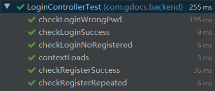
  
  * FileControllerTest
  
  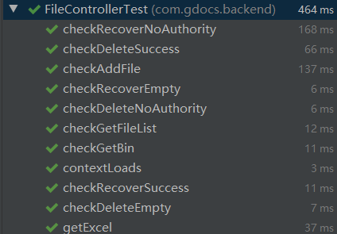
  
  * EditControllerTest
  
  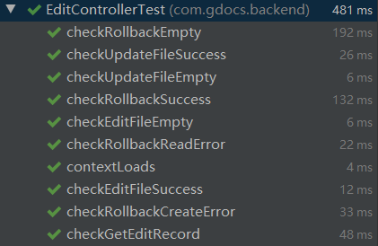

* **Test Coverage**
  
  * Controller
    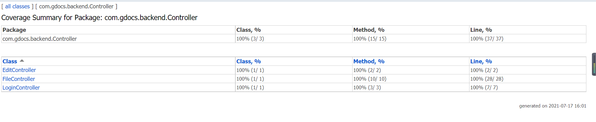
  * Service
    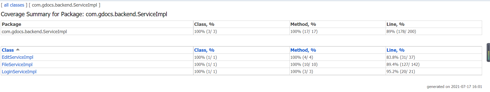

### 2. Performance Test

*Naive gDocs*的后端采用jmeter对Controller层接口进行性能测试。

测试文件见`\code\gdocsbackend\performance.jmx`。

* **测试环境**
  
  > 处理器：Intel(R) Core(TM) i7-10750H CPU @ 2.60GHz   2.59 GHz
  > 
  > RAM：16.0 GB (15.8 GB 可用)
  > 
  > 操作系统：Windows 10 家庭中文版 20H2
  > 
  > 测试工具：apache-jmeter-5.3
  > 
  > 线程组：100，启动时间：5s，循环次数：6
* **测试结果**(单位：ms)
  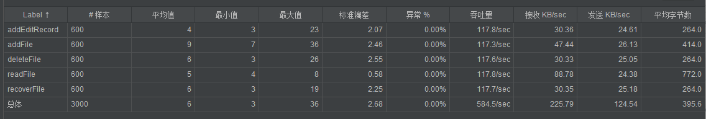

### 3. Interpretation of Results

  正确性测试以较高的覆盖率完成了测试，并且接口的正确性全部通过，每个请求可以针对不同的错误类型(如：文件不存在，写入DFS失败等)返回不同的reply参数，保有容错性，使前端能够针对参数进行解析反馈给客户端错误类型。

  在性能测试中，后端接口*addEditRecord,deleteFile,recoverFile*的主要操作是对数据库进行插入和修改，可从结果得知对大量并发的请求也具有较好的支持性。

  *addFile,readFile*是对前端请求进行处理并转发给DFS，再将DFS的返回值处理包装返回给前端，因此这两个接口的性能受到DFS的限制。观察得readFile的平均值与DFS的read操作时间均为0.006s/op，响应时间很快，性能比较好。

  由于编辑文件操作使用websocket进行传输，jmeter本身不支持ws协议，暂未进行测试。

## Distributed File System

### Single-Master

*Single-Master Distributed File System test* 通过 go test 进行测试。

测试文件见`/code/src/gfs/test/graybox_test.go`

#### 1. correctness test

*correctness test* 详情见测试文件中以`Test` 开头函数。
测试的具体内容如下所示，正确性测试全部通过。

* **Master Operations**
  
  + get chunk handle
    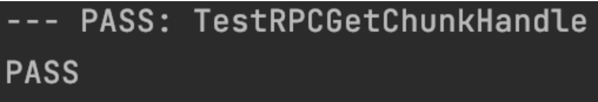
  + get replicas
    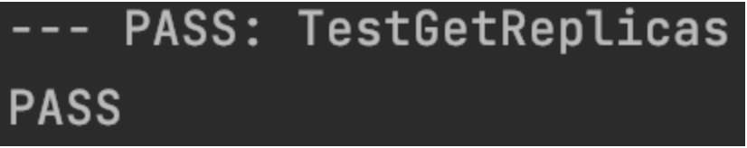
  + check replicas equality
    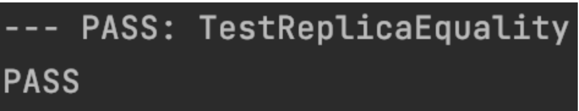
  + get file info
    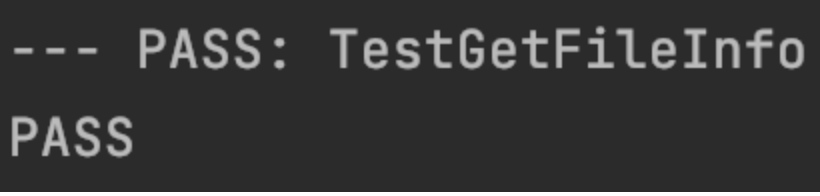

* **Client API**
  
  + create file
    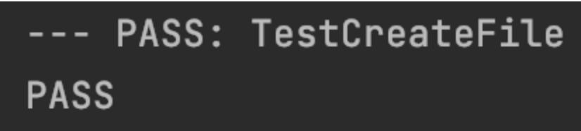
  
  + delete file
    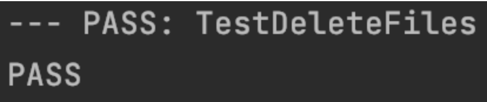
  
  + create and delete concurrently
    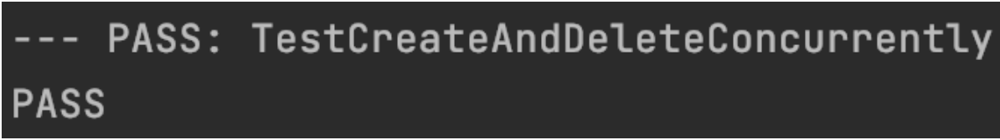
  
  + rename file
    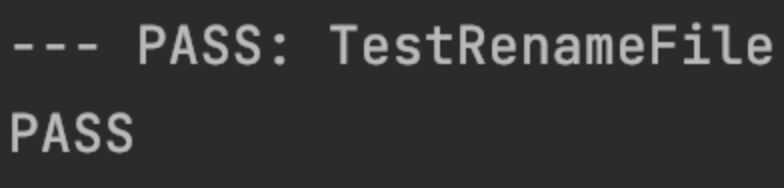
  
  + mkdir
    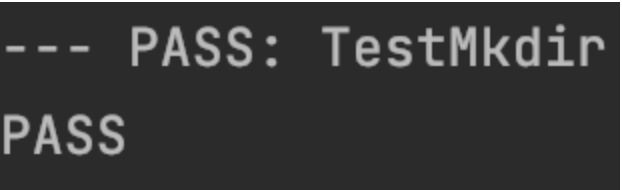
  
  + write and read big data
    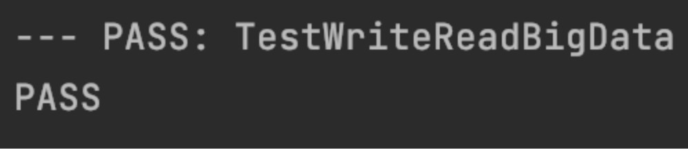
  
  + append pad over (if the append would cause the chunk to exceed the maximum size this chunk should be pad and the data should be appended to the next chunk)
    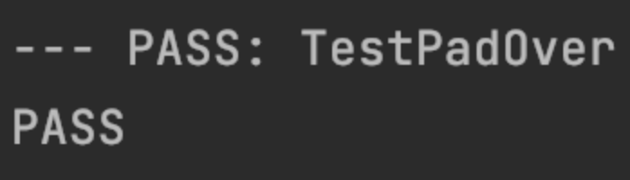
  
  + concurrent read and append
    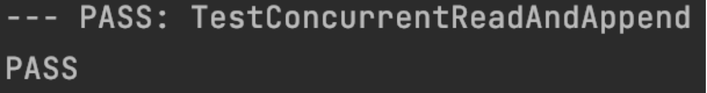

* **Fault Tolerance**
  
  + shutdown a chunk server during operations
    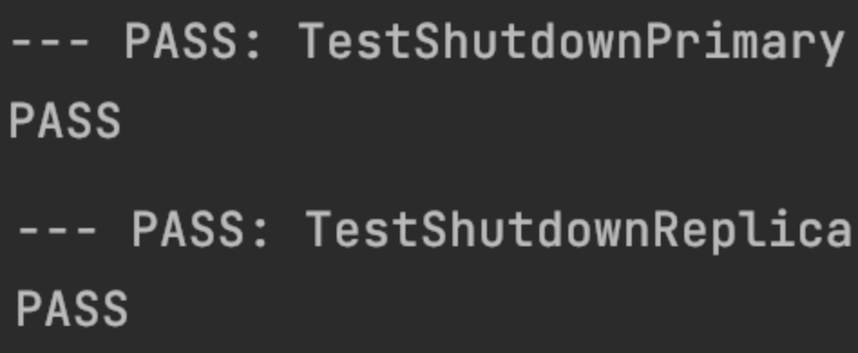
  
  + shutdown a master during operations (This test only exists in branch multi-master gfs test file)

* **Persistent Tests**
  
  + check consistency after reastarting a master
  + check consistency after reastarting a chunk server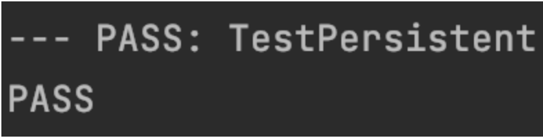

#### 2. performance test

*performance test* 通过 go Benchmark 进行测试。详情见测试文件中以`Benchmark` 开头函数。
测试环境为

> goos: darwin
> goarch: amd64
> cpu: Intel(R) Core(TM) i5-7360U CPU @ 2.30GHz

* **read**
  测试中每次读的长度大小为一个*chunk*长度
  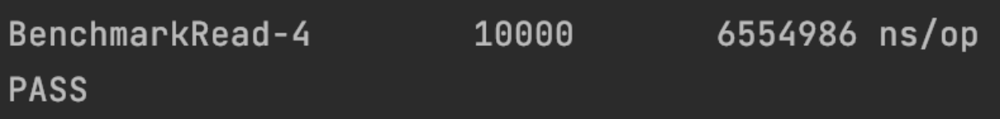
  约为0.006s/op

* **write**
  测试中每次写的长度大小为一个*chunk*长度
  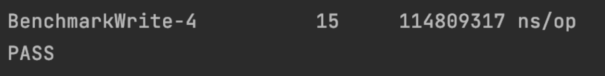
  约为0.114s/op

* **append**
  测试中每次*append*的长度大小为一个*chunk*长度
  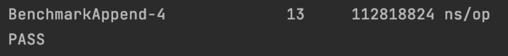
  约为0.112s/op
  
  #### 3. defects and corresponding improvement methods

* **snapshot**
  
  除了基本的文件接口和加入的 append 外，client API 可以考虑加入 snapshot，用来快速复制文件，snapshot 应只新建新的 metadata，不需要新建新的 chunk，新建的metadata 与之前的metadata 指向相同的 chunk，采用COW方法，只有其中一方改变文件才会新建对应chunk。
  
  snapshot 对于需要大量复制文件的应用非常友好，对于 naive gdocs来说，增加 snapshot API可以提高版本回滚的用户体验。

* **master crash**
  
  *Single-Master DFS*  无法处理唯一的 master crash的问题，虽然可以通过与备份的 master 节点同步数据，记录log等方式保证一致性，但是却不能相应 client 请求，除非维护人员意识到 master 已经不在工作，重启新的master并通知对应的 chunk server 和 client，才能使系统恢复工作。
  
  对于这个问题我们组考虑的解决办法是使用 zookeeper 设计 *Multi-Master DFS* ；也可以增加一个新的 view 节点，实时检测 master 的存活情况，并作出相应措施，但是这样view 节点的存活问题就会成为新的技术难点。

### Multi-Master

*Multi-Master Distributed File System test* 通过 go test 进行测试。

测试文件见`/code/src/gfs/test/graybox_test.go`

#### 1. correctness test

*correctness test* 详情见测试文件中以`Test` 开头函数。
测试的具体内容如下所示，正确性测试全部通过。

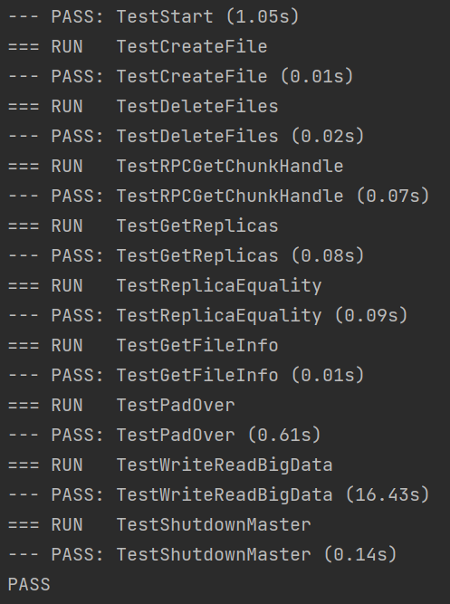

#### 2. performance test

由于 *Multi-Master* 的设计有许多 spin lock，而且获得元数据需要跟 zookeeper 进行交互，所以导致性能不佳，非常遗憾，与 *Single-Master* 相同的性能测试在 *Multi-Master* 上没有测出有用结果。

#### 3.  defects and corresponding improvement methods

+ **cache**
  
  由于 *Multi-Master DFS* 性能不加，主要原因有每次读取元数据都需要与 zookeeper 进行交互的原因，可以考虑在每个 master 节点增加 cache，但是这样会引入一致性的问题。

+ **Read-Write lock**
  
  通过 zookeeper 提供的接口，设计读写锁，替换掉项目中对应的 spin lock 来提高性能。
